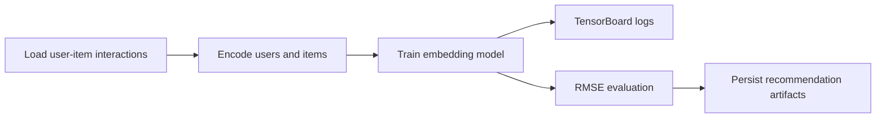

# recommendation-model-tensorflow

## Português

`recommendation-model-tensorflow` é um projeto de recomendação com `TensorFlow/Keras` e observabilidade de treino via `TensorBoard`, desenhado para mostrar como um modelo neural com embeddings de usuário e item pode ser estruturado de forma reproduzível.

### Storytelling técnico

Sistemas de recomendação não dependem só de regras manuais ou similaridade explícita. Em muitos cenários, o valor do modelo está em aprender representações latentes de usuários e itens, capturando afinidades que não aparecem diretamente em uma tabela de interações. É justamente aí que embeddings neurais fazem sentido, e é também aí que `TensorBoard` ajuda a observar se o treinamento está convergindo de forma estável.

Este projeto foi desenhado com essa lógica:

- materializa um conjunto sintético de interações `user-item-rating`;
- codifica usuários e itens para índices inteiros;
- tenta executar o caminho principal com embeddings em `TensorFlow/Keras`;
- grava logs em `logs/fit/` para inspeção via `TensorBoard`;
- mantém um fallback determinístico quando `tensorflow` não está disponível.

### Objetivo arquitetural

O projeto foi estruturado para mostrar um pipeline mínimo de recomendação neural com foco em representação latente. Em vez de depender apenas de regras ou médias explícitas, o caminho principal tenta aprender embeddings para usuários e itens, permitindo que o modelo capture afinidades implícitas no espaço vetorial.

Ao mesmo tempo, o repositório mantém uma preocupação de engenharia:

- materialização reproduzível do dataset;
- codificação determinística de entidades;
- separação entre treino e teste;
- persistência de artefatos;
- logging do experimento.

Essa organização torna o projeto mais útil como portfólio técnico do que um notebook isolado.

### Arquitetura do projeto

- [src/data_factory.py](/Users/flaviagaia/Documents/CV_FLAVIA_CODEX/recommendation-model-tensorflow/src/data_factory.py)
- [src/modeling.py](/Users/flaviagaia/Documents/CV_FLAVIA_CODEX/recommendation-model-tensorflow/src/modeling.py)
- [main.py](/Users/flaviagaia/Documents/CV_FLAVIA_CODEX/recommendation-model-tensorflow/main.py)
- [tests/test_project.py](/Users/flaviagaia/Documents/CV_FLAVIA_CODEX/recommendation-model-tensorflow/tests/test_project.py)

### Papel técnico de cada arquivo

- [src/data_factory.py](/Users/flaviagaia/Documents/CV_FLAVIA_CODEX/recommendation-model-tensorflow/src/data_factory.py)
  materializa o conjunto de interações `user-item-rating`.
- [src/modeling.py](/Users/flaviagaia/Documents/CV_FLAVIA_CODEX/recommendation-model-tensorflow/src/modeling.py)
  executa o encoding das entidades, o treino do modelo principal, o fallback local, a avaliação por `RMSE` e a persistência dos artefatos.
- [main.py](/Users/flaviagaia/Documents/CV_FLAVIA_CODEX/recommendation-model-tensorflow/main.py)
  roda o pipeline de ponta a ponta e imprime o sumário consolidado.
- [tests/test_project.py](/Users/flaviagaia/Documents/CV_FLAVIA_CODEX/recommendation-model-tensorflow/tests/test_project.py)
  valida o contrato mínimo do pipeline com thresholds compatíveis com o runtime local.

### Pipeline



### Estratégia de modelagem

Quando `tensorflow` está disponível, o caminho principal usa uma arquitetura baseada em embeddings:

- `Input(user)`
- `Input(item)`
- `Embedding(n_users, 8)`
- `Embedding(n_items, 8)`
- `Flatten`
- `Dot`
- componente adicional linear sobre a concatenação dos embeddings

Esse desenho tenta combinar:

- interação latente entre usuário e item, via produto interno;
- capacidade extra de ajuste fino por meio do termo linear adicional.

A métrica principal do projeto é `RMSE`, porque o problema aqui foi formulado como predição de rating.

Quando `tensorflow` não está disponível, o projeto faz fallback para uma aproximação simples baseada em média por usuário, mantendo a execução local reproduzível sem fingir um runtime neural inexistente.

### Resultados atuais

- `runtime_mode = fallback_without_tensorflow`
- `interaction_count = 18`
- `user_count = 6`
- `item_count = 6`
- `train_interaction_count = 13`
- `test_interaction_count = 5`
- `rmse = 2.3345`

### Interpretação do resultado

O valor de `RMSE = 2.3345` foi obtido no caminho `fallback_without_tensorflow`, então ele deve ser lido como resultado da estratégia de contingência local, não do modelo neural por embeddings.

Isso é importante por dois motivos:

- mantém o projeto honesto em relação ao ambiente validado;
- deixa claro que o valor principal do repositório está na estrutura do pipeline e no desenho do modelo, não em afirmar performance neural sem runtime real disponível.

### Artefatos gerados

- interações materializadas:
  [data/raw/user_item_interactions.csv](/Users/flaviagaia/Documents/CV_FLAVIA_CODEX/recommendation-model-tensorflow/data/raw/user_item_interactions.csv)
- predições de teste:
  [data/processed/recommendations.csv](/Users/flaviagaia/Documents/CV_FLAVIA_CODEX/recommendation-model-tensorflow/data/processed/recommendations.csv)
- relatório consolidado:
  [data/processed/recommendation_model_report.json](/Users/flaviagaia/Documents/CV_FLAVIA_CODEX/recommendation-model-tensorflow/data/processed/recommendation_model_report.json)
- modelo persistido:
  [artifacts/best_model.joblib](/Users/flaviagaia/Documents/CV_FLAVIA_CODEX/recommendation-model-tensorflow/artifacts/best_model.joblib)
- histórico do run:
  [logs/fit/20260401-175034/history.json](/Users/flaviagaia/Documents/CV_FLAVIA_CODEX/recommendation-model-tensorflow/logs/fit/20260401-175034/history.json)

### Contrato do relatório final

O relatório consolidado registra:

- `runtime_mode`
- `interaction_count`
- `user_count`
- `item_count`
- `train_interaction_count`
- `test_interaction_count`
- `rmse`
- `dataset_artifact`
- `recommendation_artifact`
- `model_artifact`
- `tensorboard_log_dir`
- `history_artifact`
- `report_artifact`

### Como usar o TensorBoard

Quando `tensorflow` estiver disponível, os logs de treino são gravados em `logs/fit/<timestamp>`. O comando esperado para inspeção é:

```bash
tensorboard --logdir logs/fit
```

Na prática, isso permitiria observar:

- convergência do `loss`;
- diferença entre treino e validação;
- estabilidade do ajuste do modelo;
- comparação entre múltiplos runs.

No ambiente validado aqui, o projeto executou com `fallback_without_tensorflow`, então o diretório de logs contém uma nota de runtime em vez de curvas completas de treino.

## English

`recommendation-model-tensorflow` is a recommendation project built around `TensorFlow/Keras` embeddings and `TensorBoard`, designed to show how a neural user-item recommender can be structured with reproducibility and training observability in mind.

### Architectural intent

The repository is designed to make the recommendation workflow explicit instead of hiding everything inside a notebook. It separates:

- interaction dataset materialization;
- deterministic entity encoding;
- train/test split;
- model training;
- `RMSE` evaluation;
- artifact persistence.

This makes the project more useful as a technical portfolio example of neural recommendation systems.

### Modeling path and fallback

The preferred runtime uses user and item embeddings learned through `TensorFlow/Keras`, combined through:

- user embedding lookup;
- item embedding lookup;
- latent interaction via dot product;
- an additional linear term over the concatenated embeddings.

When `tensorflow` is unavailable, the repository falls back to a deterministic recommendation baseline. This preserves executability while keeping a clear distinction between the preferred neural path and the validated local runtime.

### Current results

- `runtime_mode = fallback_without_tensorflow`
- `interaction_count = 18`
- `user_count = 6`
- `item_count = 6`
- `train_interaction_count = 13`
- `test_interaction_count = 5`
- `rmse = 2.3345`

### Generated artifacts

- [data/raw/user_item_interactions.csv](/Users/flaviagaia/Documents/CV_FLAVIA_CODEX/recommendation-model-tensorflow/data/raw/user_item_interactions.csv)
- [data/processed/recommendations.csv](/Users/flaviagaia/Documents/CV_FLAVIA_CODEX/recommendation-model-tensorflow/data/processed/recommendations.csv)
- [data/processed/recommendation_model_report.json](/Users/flaviagaia/Documents/CV_FLAVIA_CODEX/recommendation-model-tensorflow/data/processed/recommendation_model_report.json)
- [artifacts/best_model.joblib](/Users/flaviagaia/Documents/CV_FLAVIA_CODEX/recommendation-model-tensorflow/artifacts/best_model.joblib)

### TensorBoard note

When `tensorflow` is installed, training logs are written into `logs/fit/<timestamp>` and can be inspected with `tensorboard --logdir logs/fit`. In the validated local run, the fallback path was used, so the log directory currently contains a runtime note instead of full training curves.
