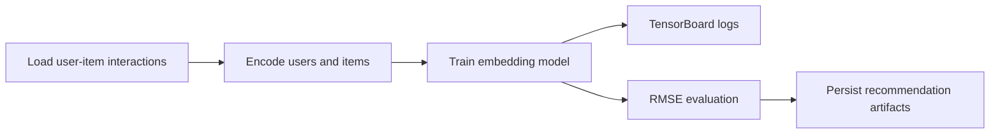

# recommendation-model-tensorflow

## Português

`recommendation-model-tensorflow` é um projeto de recomendação com `TensorFlow/Keras` e observabilidade de treino via `TensorBoard`, desenhado para mostrar como um modelo neural com embeddings de usuário e item pode ser estruturado de forma reproduzível.

### Storytelling técnico

Sistemas de recomendação não dependem só de regras manuais ou similaridade explícita. Em muitos cenários, o valor do modelo está em aprender representações latentes de usuários e itens, capturando afinidades que não aparecem diretamente em uma tabela de interações. É justamente aí que embeddings neurais fazem sentido, e é também aí que `TensorBoard` ajuda a observar se o treinamento está convergindo de forma estável.

Este projeto foi desenhado com essa lógica:

- materializa um conjunto sintético de interações `user-item-rating`;
- codifica usuários e itens para índices inteiros;
- tenta executar o caminho principal com embeddings em `TensorFlow/Keras`;
- grava logs em `logs/fit/` para inspeção via `TensorBoard`;
- mantém um fallback determinístico quando `tensorflow` não está disponível.

### Arquitetura do projeto

- [src/data_factory.py](/Users/flaviagaia/Documents/CV_FLAVIA_CODEX/recommendation-model-tensorflow/src/data_factory.py)
- [src/modeling.py](/Users/flaviagaia/Documents/CV_FLAVIA_CODEX/recommendation-model-tensorflow/src/modeling.py)
- [main.py](/Users/flaviagaia/Documents/CV_FLAVIA_CODEX/recommendation-model-tensorflow/main.py)
- [tests/test_project.py](/Users/flaviagaia/Documents/CV_FLAVIA_CODEX/recommendation-model-tensorflow/tests/test_project.py)

### Pipeline



### Resultados atuais

- `runtime_mode = fallback_without_tensorflow`
- `interaction_count = 18`
- `user_count = 6`
- `item_count = 6`
- `train_interaction_count = 13`
- `test_interaction_count = 5`
- `rmse = 2.3345`

### Artefatos gerados

- interações materializadas:
  [data/raw/user_item_interactions.csv](/Users/flaviagaia/Documents/CV_FLAVIA_CODEX/recommendation-model-tensorflow/data/raw/user_item_interactions.csv)
- predições de teste:
  [data/processed/recommendations.csv](/Users/flaviagaia/Documents/CV_FLAVIA_CODEX/recommendation-model-tensorflow/data/processed/recommendations.csv)
- relatório consolidado:
  [data/processed/recommendation_model_report.json](/Users/flaviagaia/Documents/CV_FLAVIA_CODEX/recommendation-model-tensorflow/data/processed/recommendation_model_report.json)

### Como usar o TensorBoard

Quando `tensorflow` estiver disponível, os logs de treino são gravados em `logs/fit/<timestamp>`. O comando esperado para inspeção é:

```bash
tensorboard --logdir logs/fit
```

No ambiente validado aqui, o projeto executou com `fallback_without_tensorflow`, então o diretório de logs contém uma nota de runtime em vez de curvas completas de treino.

## English

`recommendation-model-tensorflow` is a recommendation project built around `TensorFlow/Keras` embeddings and `TensorBoard`, designed to show how a neural user-item recommender can be structured with reproducibility and training observability in mind.

### Current results

- `runtime_mode = fallback_without_tensorflow`
- `interaction_count = 18`
- `user_count = 6`
- `item_count = 6`
- `train_interaction_count = 13`
- `test_interaction_count = 5`
- `rmse = 2.3345`
